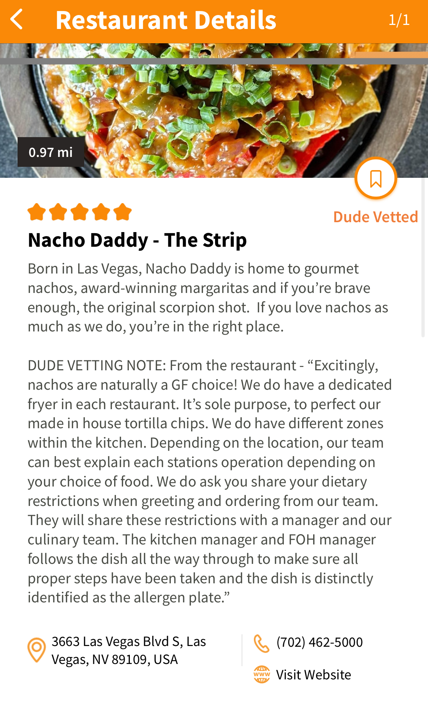
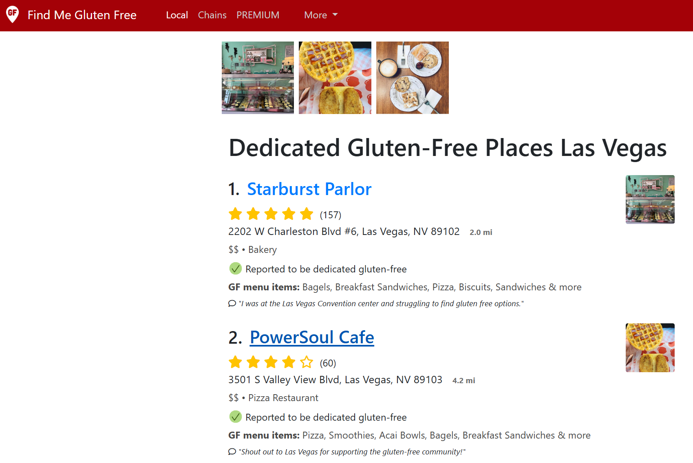

Ever wonder how everyone is finding all these great gluten free places to eat at? Look no further! Here is a collection of apps that we have used to find safe places for us to eat.

---
## Gluten Dude
[Gluten Dude](https://glutendude.com/) restaurant finding app does require a subscription, however, all of the establishments in the app are screened by Gluten Dude to make sure that they are safe for dining at. Gluten Dude's website also has a ton of other resources regarding celiac and gluten free. 

## Find Me Gluten Free
[Find Me Gluten Free](https://www.findmeglutenfree.com/) has a large amount of restuarants that are rated all around the world. This app allow users to review restaurants for the quality of the food, how safe it is, and variety of gluten free food available. You can also search for all restaurants that are dedicated gluten free facilities. This is a free app, but there are additional features that you can access for a subscription fee. 

